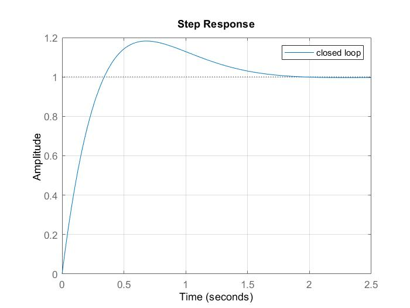
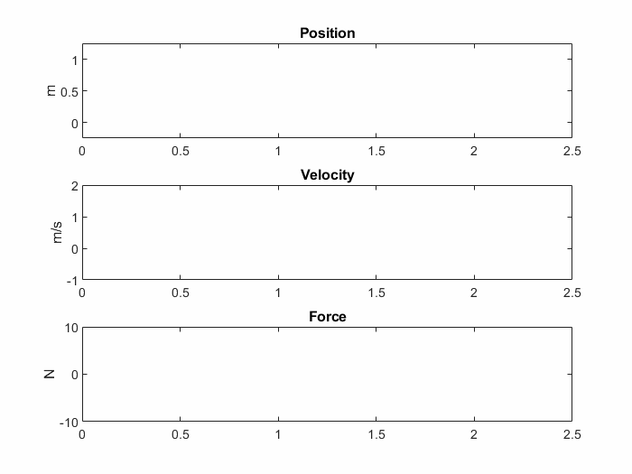
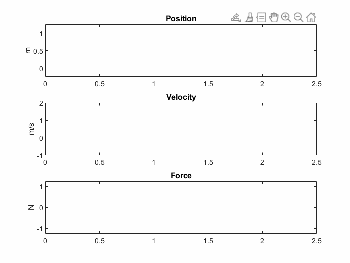
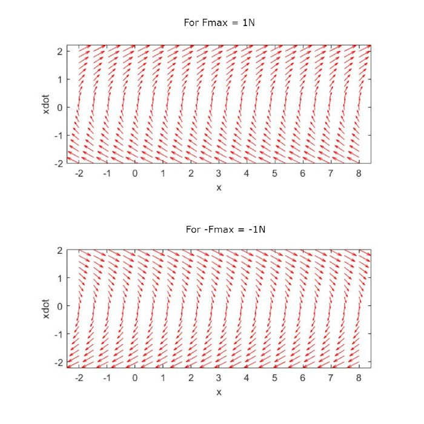
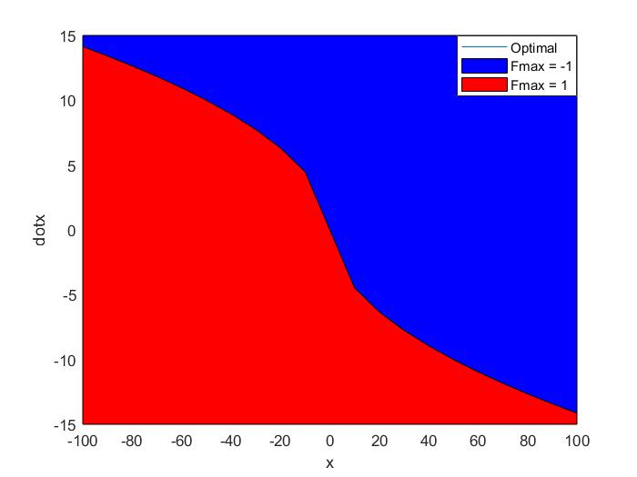

<!--Main title-->
# The Bang-bang controller!
How to get from point A to B in the shortest time
<!--End main title-->

<!--Block content-->	
## Mission
I have been fascinated by the Bang bang controller that Prof.Dr Russ Tedrake explained in his famous lectures, and I wanted to implement it in Matlab, because it has a lot of applications, especially in robotics—for instance, the optimization of the movement of legs for the [Cheetah robot](https://ieeexplore.ieee.org/document/8593885), or even optimizing the motor to [solve a Rubik's cube in a record time](https://news.mit.edu/2018/featured-video-solving-rubiks-cube-record-time-0316).

We have a mass \(M\) (for simplification, we put \(M = 1kg\)), and we can apply a force \(F\) on it. The mass moves along a line (1-D). We would like to move the mass from (Point \(A\)) to point \(B\) and it should come to rest at that point.

Ignoring the shortest possible time part of the question for a second, the obvious linear control approach to this is a \(PD\) controller.

Now we add a simple constraint: Limit to how big \(F\) can be.

Our linear control strategy won't be the optimal regarding the shortest time needed, as there isn't one single control law that gives identical performance for different step sizes.

This problem is quite classic in the field of optimal control. For more literature information, check "minimum time control."

## Job Done
In this Project, we formulated the problem as an optimal Bang-Bang control policy and then defined a cost function. Afterward, we solved it using dynamic programming to find the most optimal control solution.

## PD Controller Results
At first, I tried to control the system with a \(PD\) controller and see the results. I found that for some gains, the system may overshoot, but if we crank up the gain to the optimal level using [SISOTOOL](https://www.mathworks.com/help/control/ref/controlsystemdesigner-app.html), we get optimal results.

Here are the results for \(K_p = 10\), and \(K_d = K_p/2\).

## Bang-Bang Controller Results
The results seem neat and converge quite well. We might improve it by setting a limitation on the force \(F\), in this case, \(F_{\text{max}} = 1N\).

Even though the controller is still not a Bang-bang controller because the slope between the 2 states is a finite number. The difficulty of the problem arises from the fact that this is an optimal control problem, which makes it necessary to formulate the problem as a cost function framework and then solve it with one of the iterative methods to find the optimal solution and the least cost expensive. In this case, that would be either dynamical programming or graph search.

Since we are looking for the most optimal control policy, we should first write the mathematical description of the problem and then define the cost function.

We can formulate our problem mathematically as the following:

\[
\begin{align*}
\text{minimize} \quad & t_f\\
\text{subject to} \quad & x(t_0) = x_A, \\
& x(t_f) = {x_B}, \\
& \ddot{x}(t) = F(t), \\
& |F| \le 1.
\end{align*}
\]

The physical intuition to solve the problem is pretty easy to imagine if the mass \(M\) was a car, and you were driving it, and you had to stop at a certain distance from the start, the obvious solution would be to accelerate as much as you can and then hit the brakes before you get to the arrival point, which is actually a [Bang-Bang control policy](https://en.wikipedia.org/wiki/Bang%E2%80%93bang_control)!

The remaining question is how can we formulate this mathematically!? It turns out to be pretty straightforward by taking a look at the system in the [phase plane](https://en.wikipedia.org/wiki/Phase_space).

The system has 2 states: the position \(x(t)\) and the velocity \(\dot{x}(t)\), so to get the phase plane, we have to represent the velocity as a function of the position: \(\dot{x}(x)\).

We start with the case where the mass is at acceleration \(F_{\text{max}}\) and we drive the functions that describe the phase plane, and then we do the same calculation for \(-F_{\text{max}}\).

From the 2nd law of Newton \( \ddot{x}(t) = F_{\text{max}} = 1 \, \text{N} \), we can integrate to get velocity, and again to get position, giving the result:

\[ 
\begin{align*}
\ddot{x}(t) &= F_{\text{max}} = 1 \\
\dot{x}(t) &= \dot{x}(0) + t \\
x(t) &= x(0) + \dot{x}(0) t + \frac{1}{2} t^2.
\end{align*} 
\]

We get rid of the time variable by substituting \(t\) from the second equation: \(t = \dot{x} - \dot{x}(0)\), and plugging it in the third equation, we get:

\[ x = \frac{1}{2} \dot{x}^2 + \text{cnt}_1 \]

with \(\text{cnt}_1 = x(0) - \frac{1}{2}\dot{x}^2(0)\).

For the deceleration phase \( \ddot{x}(t) = -F_{\text{max}} \) with \( -F_{\text{max}} = -1 \, \text{N} \) we get:

\[ x = - \frac{1}{2} \dot{x}^2 + \text{cnt}_2 \]

with \(\text{cnt}_2 = x(0) + \frac{1}{2}\dot{x}^2(0)\).

For the sake of making the problem more visually understandable, we give the coordinate \(x_B = 0\) to the arrival point \(B\), and we already know that \(\dot{x}_B = 0\). We draw the phase plot for both trajectories, we get:

From that, we can conclude the Bang-bang policy used for optimal control:

TO BE CONTINUED.....................
